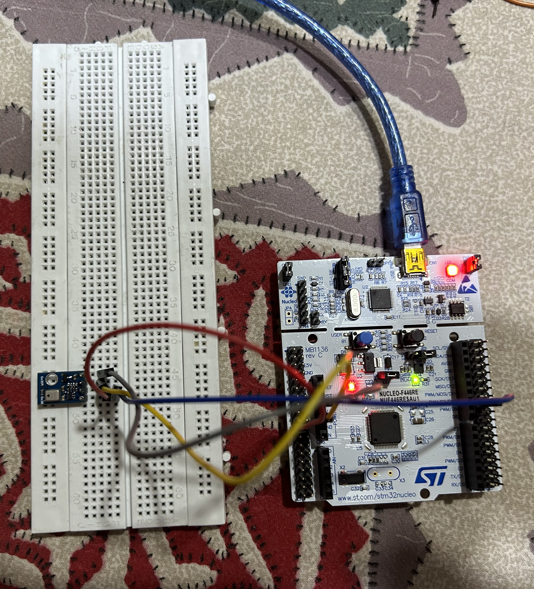

# LED Blink Project

## Overview

This project demonstrates how to interface with the AHT10 sensor to read temperature and humidity data using the I2C protocol. The data is then transmitted to a PC and displayed on the screen via UART communication. This project provides a practical example of integrating sensors with microcontrollers and utilizing serial communication to interface with a computer.

## Demo

