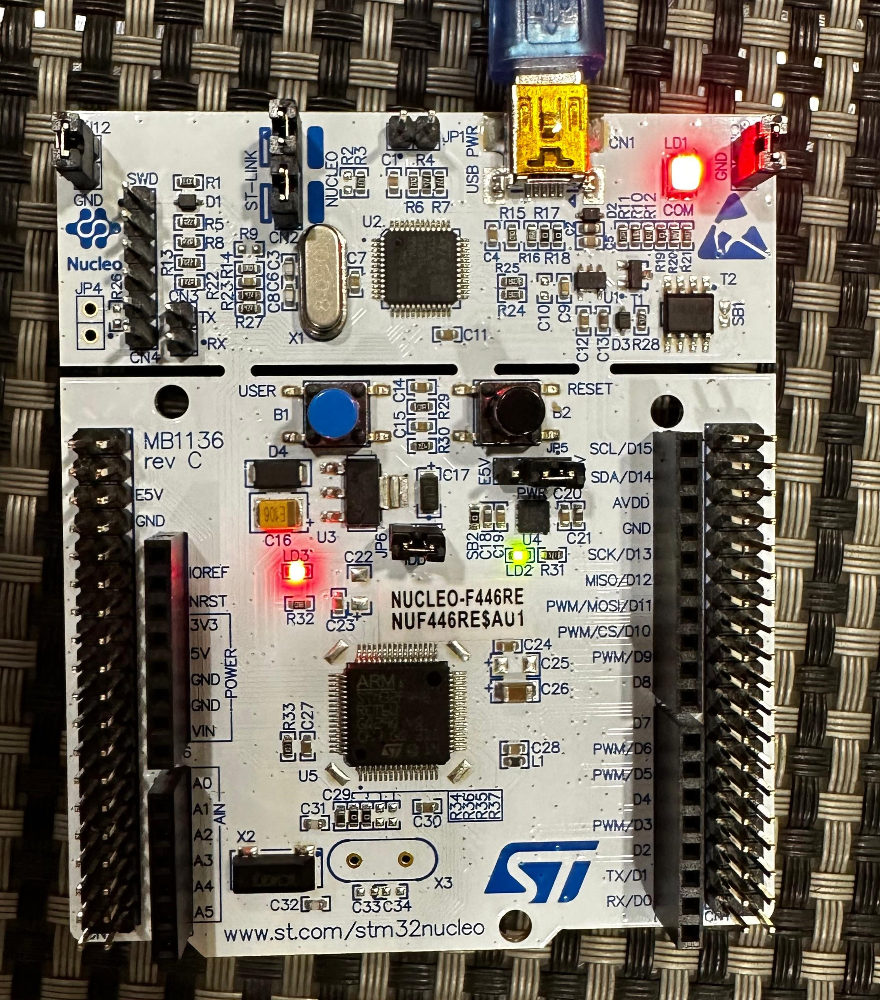

# LED Blink Project

## Overview

This project demonstrates how to use an interrupt to toggle an LED on and off, addressing the issue of key bouncing using a debouncing technique with interrupts and timers.

## Problem Statement

Key bouncing is a common issue when using buttons, causing multiple triggers from a single press. Simple pull-up or pull-down methods are often insufficient to counteract this issue.

## Demo

